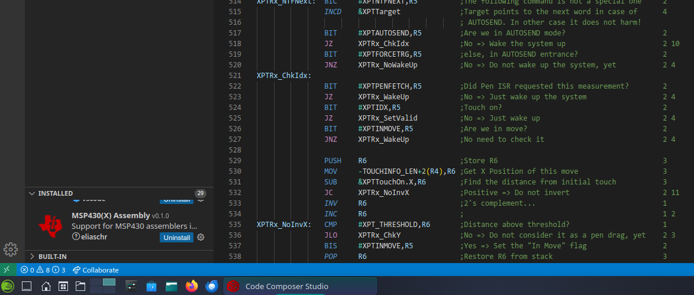
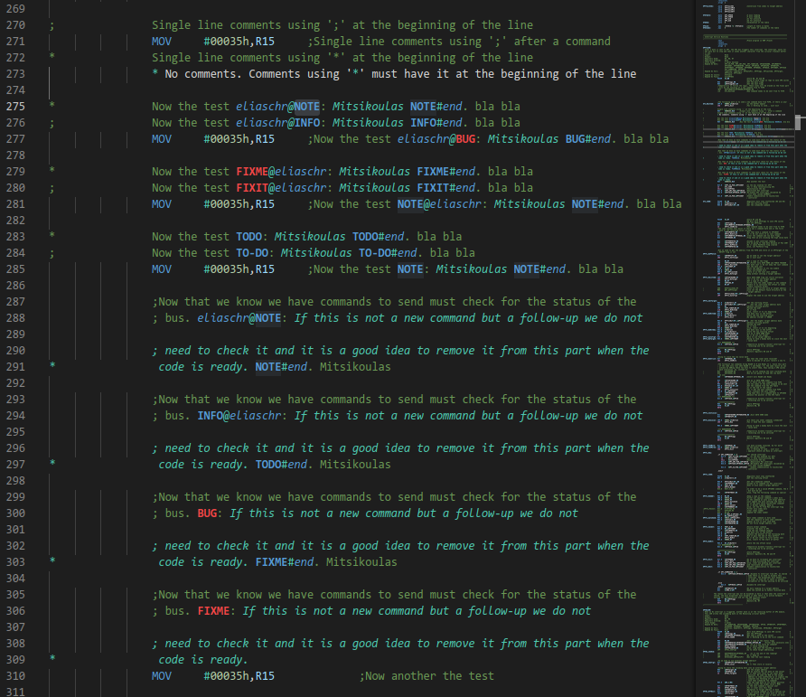
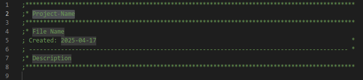
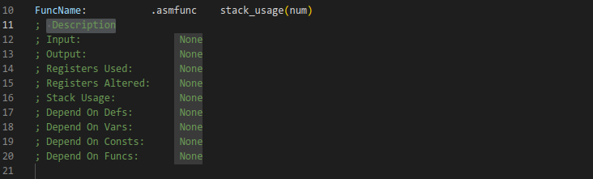

# MSP430 and MSP430X Assembly language Syntax Highlighting

The current extension was written to support assembly syntax highlighting for MSP430 and
MSP430X family of microcontrollers of Texas Instruments, in Code Composer Studio Theia. Since
CCS Theia is based on Eclipse Theia, the extension can be used also in Visual Studio Code
(VS Code).

**Texas Instrumenst and the TI logo are trademarks of Texas Instruments Incorporated.**

## DISCLAIMER

THE SOFTWARE IS PROVIDED "AS IS", WITHOUT WARRANTY OF ANY KIND, EXPRESS OR IMPLIED, INCLUDING
BUT NOT LIMITED TO THE WARRANTIES OF MERCHANTABILITY, FITNESS FOR A PARTICULAR PURPOSE, TITLE
AND NON-INFRINGEMENT. IN NO EVENT SHALL THE COPYRIGHT HOLDERS OR ANYONE DISTRIBUTING THE
SOFTWARE BE LIABLE FOR ANY DAMAGES OR OTHER LIABILITY, WHETHER IN CONTRACT, TORT OR OTHERWISE,
ARISING FROM, OUT OF OR IN CONNECTION WITH THE SOFTWARE OR THE USE OR OTHER DEALINGS IN THE
SOFTWARE.

## What the extension provides

The extension provides syntax highlighting when programming in assembly language. It provides
different colouring for:
- **Labels**: Labels always start at the first column of a line and they optionally are followed
by a colon ':'. Labels that are local (in macros) must have a ? at their end. Also there is
the posibility of a substitution label which is in the form of \:label\:. All of these kinds
of labels are recognised and highlighted.
- **Memonics**: There are different kinds of mnemonics, the normal mnemonics and the emulated
ones. The extension can recognise all of them. Also, the flow control mnemonics, like CALL or
JEQ, are highlighted differently.
- **Suffixes**: Mnemonics can have a suffix to define is they act on byte, word or address (24 bit
values). They are .B, .W or .A. Not all mnemonics can have a suffix.
- **Registers**: R0 to R15, PC, SR and SP.
- **Strings**: Single or double quoted ones.
- **Escaped Characters**: Characters that are escaped with \\, like \\n.
- **Numbers**: All kinds of syntaxes the assembler supports, as 0xF327 or 0F327h, etc.
- **Operators**: Special characters to perform arithmetic or logical operations, etc.
- **Built-in Functions++: There are preprocessor functions defined, as $HI16 or $isdefed. They
are recognised and highlighted properly.
- **preprocessor Directives**: They are also recongised and highlighted.
- **Comments**: No comment! :)

## Additional Comment Functionality

In the comments there can be some special words that define a special comment. The words are:
- **NOTE**
- **INFO**
- **TODO** or **TO-DO**
- **FIXME** or **FIX-ME**
- **FIXIT** or **FIX-IT**
- **BUG**

These words can be used in different ways, always inside comments:
- **Single**: Just the special word followed by a colon \(':'\).
- **Username prefixed**: Like "username@INFO:"
- **Username postfixed**: Like "TODO@username"

All these,trigger a special comment. A special comment continues until:
- **Ended**: A special phrase like "BUG#end" is met.
- A line of code is met.

All empty lines within a special comment belong to it, thus an empty line does not terminate
them. The special comments are highlighted differently than simple comments to attract the
programmers eye. Special words **FIXME**, **FIX-ME**, **FIXIT**, **FIX-IT** and **BUG** are
red, to give the meaning of a warning.

## Colour Theme

Nope... Code Composer Studio Theia does not allow colours to be changed. It defines its own
colour themes and THAT'S IT! \(At least I haven't found the way to do it, but it seems to
ignore anything that tries to change colours\). So, the used tags depend on their colour set
by the creators of Code Composer Studio Theia.

## Some Snippets

In this extension there are some snippets defined. Of course you are free to alter them at
your wish in the snippets file. They are made having in mind... MY OWN NEEDS!.

The snippets are:
- **.func**: Triggers the .asmfunc syntax
- **.endfunc**: Triggers the .endasmfunc
- **.macro**: Triggers the .macro syntax snippet
- **.endm**: Triggers the .endm
- **.struct**: Triggers the .struct syntax snippet
- **.endstruct**: Triggers the .endstruct syntax snippet
- **.tag**: Triggers the .tag syntax snippet
- **#intro**: Triggers a block of comments for the beginning of a file to include project
name, filename, creation date and description

- **#head**: Triggers a block of comments I use at the beginning of every function I write, to
describe its functionality, input, output, registers used, registes altered, stack usage,
definitions, variables, constants and functions that are used in it.

